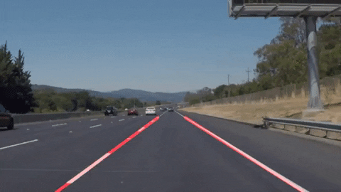

# Lane Lines Fitting

This project utilizes techniques including gaussian-blur, canny-edge detection, polygon-masking, and hough-transforming to detect lane lines on images and videos. Data for this tasks are drawn from the [KITTI dataset](http://www.cvlibs.net/datasets/kitti/raw_data.php?type=road).

